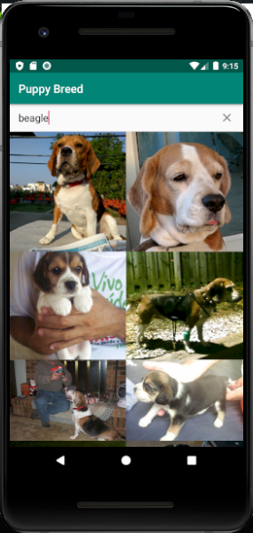

# App Perros

App Android - Kotlin Raza de perros.

## Capturas

## Librerías y API
- Retrofit2
- Gson
- Coroutines
- RecyclerView
- SearchView
- Coil
- API [https://dog.ceo/dog-api/](https://dog.ceo/dog-api/)

## Contributing
Pull requests are welcome. For major changes, please open an issue first to discuss what you would like to change.

Please make sure to update tests as appropriate.

## License
[MIT](https://choosealicense.com/licenses/mit/)
